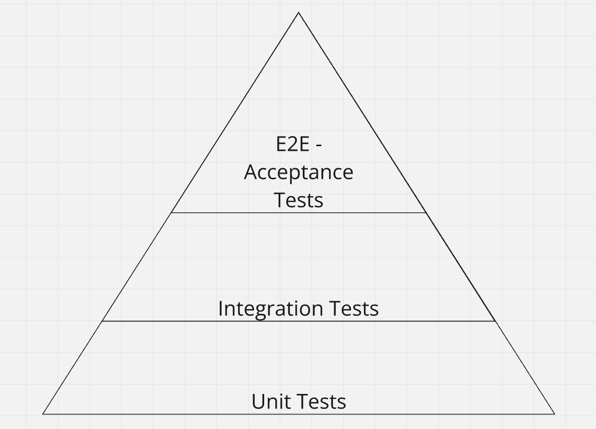

# Testing strategy

The following document describes the testing strategy of the Camunda mono repository.

After reading this guide the reader should understand what kinds of tests exist, how to write tests, and where to write them, if necessary.
It can be seen as a reference for engineers and outside collaborators.

> [!Note]
>
> If you detect anything incomplete/wrong, please open PR or issue to get this fixed.


## General overview - Testing pyramid

> The “Test Pyramid” is a metaphor that tells us to group software tests into buckets of different granularity. It also gives an idea of how many tests we should have in each of these groups.
> https://martinfowler.com/articles/practical-test-pyramid.html

It has different notations, often depending on the context. But the general gist is that you should have:

 * unit tests, quick in execution, testing components in isolation
 * integration tests, slower in execution, testing components with dependencies
 * E2E or acceptance tests, slow, testing a complete user journey or a feature end-to-end (E2E)




## Unit tests

[//]: # (### What is a unit test)

A test which validates/verified the behavior of just one component or unit, without dependencies is a unit test.

> [!Note]
>
> A unit or component can be just one class, but doesn't need necessarily.

Key properties:

* Small scoped:
  * one unit test should validate one behavior
  * Testing without dependencies
* Fast: A unit test should be quick in execution
  * Comes with small scoped
* Most of our tests should be unit tests (see testing pyramid above)
  * As they should be fast and small scoped we can have many of them

> [!Note]
>
> The key properties are rule of thumb, we should try to stick with it, there might be cases to break with this.

###  Small scoped

**Why:**
  * To separate concerns
    * To make sure we test on component/unit in isolation, building confidence that this unit itself behaves correctly
      * If not small scoped we might not test one unit, and can't be sure whether any other behavior influences the test
    * A test fail shows specific that one unit and behavior is affected
  * Allows to be quick in execution time, when focusing on one small unit with little setup
  * Reduces the maintainability/readability
    * as tests are not affected by changes in other components
    * it makes clear and understandable what is tested

#### Do's:
```java
@Test
public void shouldAddSomeValues() {
  // given
  // .. set up component/unit/class
  final var calculator = new Calculator();
  final var expectedValue = 7;

  // when
  // .. trigger some behavior
  final var actualValue = calculator.add(2, 5);

  // then
  // .. validate result / behavior
  assertThat(actualValue).isEqualTo(expectedValue);
}
```

The test is a unit test because:

  * It is small scoped
    * it tests one behavior - addition
    * it has no dependencies
  * Side-effect: It is likely to be quick

#### Dont's: Usage of dependency

```shell
@Test
public void shouldReturnSuccessfulResponse() {
  // given
  .. set up database
  .. set up client

  // when
  final var response = client.sendRequest();

  // then
  assertThat(response.statusCode).isEqualTo(200);
}
```

This test is not a unit test, because:

* It is not small scoped:
  * it tests one behavior, but it depends on other components to run
* Test is an integration test, as we are integrating with a dependency.

#### Dont's: Testing multiple behaviors

```shell
@Test
public void shouldAddAndSubstract() {
  // given
  // .. set up component/unit/class
  final var calculator = new Calculator();
  final var expectedValue = 5;

  // when
  // .. trigger some behavior
  final var actualValue = calculator.add(2, 5);

  // then
  // .. validate result / behavior
  assertThat(actualValue).isEqualTo(expectedValue);

  // when
  // .. trigger some behavior
  final var anotherValue = calculator.sub(2, actualValue);

  // then
  // .. validate result / behavior
  assertThat(anotherValue).isEqualTo(expectedValue);
}
```

This test is not a unit test, because:

* It is not small scoped:
  * it tests multiple behaviors at once
  * it has a dependency, to an early behavior of the component


[//]: # ()
[//]: # (### When/Where should I write the unit test)


[//]: # (TODO: General thing &#40;move later&#41; If you see yourself fixing a bug, you must write at least one test.)

## Integration test

### What is an integration tests

### When should I write an integration test

### Where should I write an integration test

## Acceptance test

> [!Note]
>
> Formerly known as QA - Tests

### What is an acceptance test

### When should I write an acceptance test

### Where should I write an integration test
